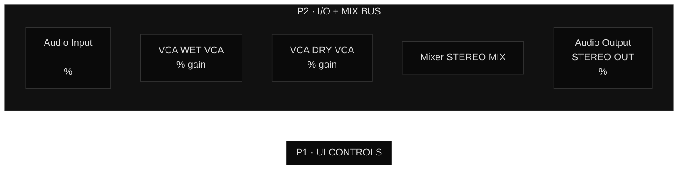

# ZOIA Patch Documentation Skill

You are an expert in the **Empress ZOIA** modular effects pedal and its eurorack sibling the **ZEBU**. When this skill is active, you document existing ZOIA patches and help design new ones, outputting a consistent, complete set of documentation files.

---

## 1. ZOIA Architecture Fundamentals

### The Grid
- The ZOIA has a **40-button grid** arranged as **8 columns × 5 rows**
- Modules occupy 1 or more contiguous blocks on this grid
- Each page is a full 40-block grid; ZOIA supports **up to 6 pages** (ZEBU: same)
- Colour of a module's LED(s) determines its functional group

### Signal Types
| Type | Symbol | Colour | Description |
|---|---|---|---|
| Audio | `→` solid line | Sky/Blue | Full-rate audio signal |
| CV | `-.->` dashed line | Yellow | Control voltage (0–1 range) |
| Gate | `-.->` dashed | Yellow/Green | On/off trigger CV |

### Connection Strengths
Connection strength (0.0–1.0) attenuates the signal. Documented as a percentage (e.g. 0.75 = 75%).

### V/Oct vs Linear CV
- The **Pitch Detector** outputs V/Oct pitch CV (ZOIA standard: 0 = C4 = ~260Hz)
- Delay time inputs expect **linear CV** (0–1 = 0–max_time ms)
- These are **not directly compatible** — document approximations and workarounds explicitly

### CPU Budget
- **Ceiling: 95%** (hard limit, ZOIA crashes above this)
- **Safe budget: ~80%** for real-time stability
- Document both per-module DSP cost and a running total
- If CPU > 85%: document which modules to remove first and how many % each saves

---

## 2. Official Module Catalogue

Use **exact official names** — these are what appear on the ZOIA firmware and must be used in all documentation.

| Module | Min Blocks | DSP% | Notes |
|---|---|---|---|
| Audio Input | 2 | 0.3% | blocks: audio in (L) \| audio in (R) |
| Audio Output | 3 | 1.0% | blocks: audio out (L) \| audio out (R) \| mix |
| VCA | 3 | 0.3% | blocks: audio in \| level control \| audio out |
| SV Filter | 4 | 1.0% | blocks: audio in \| frequency \| resonance \| lowpass out |
| Delay Line | 3 | 2.0% | blocks: audio in \| delay time \| audio out. max_time option = 100ms |
| Pitch Detector | 2 | 2.3% | **ONLY 2 blocks**: audio in \| pitch out. **NO gate output** |
| Env Follower | 2 | 2.5% | blocks: audio in \| CV output |
| Comparator | 3 | 0.04% | blocks: CV positive in \| CV negative in \| CV output |
| Sample and Hold | 3 | 0.1% | blocks: CV input \| trigger \| CV output |
| ADSR | 6 | 0.07% | blocks: cv input \| attack \| decay \| sustain \| release \| cv output |
| CV Mixer | 5 | 0.3% | blocks: cv in 1 \| cv in 2 \| atten 1 \| atten 2 \| cv output. Set attens to 1.0 to sum. |
| Value | 2 | 0.15% | blocks: value (cv input) \| CV output |
| Stompswitch | 1 | 0.1% | Single block toggle or momentary |
| Tone Control | 9 | 2.2% | blocks: aud in L \| low shelf \| mid gain \| mid freq \| high shelf \| output L (+ optional R) |
| Reverb Lite | 5 | 6.5% | blocks: input L \| decay time \| mix \| output L \| output R |
| Audio Balance | 7 | 0.8% | stereo: audio in1 L \| in1 R \| in2 L \| in2 R \| mix \| audio outL \| audio outR |
| CV Rectify | 2 | 0.07% | blocks: CV input \| CV output. Keeps pitch CV in 0–1 range. |
| Mixer | 4–8 | 0.3% | Mono audio summing. Block count = N inputs + output |
| Chorus | varies | 6–10% | **CPU-heavy** — use Audio Balance for stereo width instead |
| Onset Detector | varies | 12.3% | **CPU-heavy** — prefer Env Follower + Comparator (saves ~10%) |
| MIDI Note In | 2 | 0.1% | blocks: note \| gate |
| MIDI CC In | 2 | 0.05% | blocks: cc number \| cv output |
| Oscillator | 4 | 1.5% | blocks: pitch \| waveshape \| output \| level |
| LFO | 4 | 0.5% | blocks: rate \| waveshape \| output \| phase |
| Looper | varies | 8–15% | CPU scales with loop length |

**Common Mistakes to Avoid:**
- ❌ There is no "Resonator" module — use Delay Line + VCA feedback comb filters
- ❌ There is no "CV Adder" — use CV Mixer with attenuators set to 1.0
- ❌ Pitch Detector has NO gate output — generate gate with Env Follower + Comparator
- ❌ VCA block 3 is `level control` not `gain_cv`
- ❌ Chorus CPU is 6–10%, not 3%

---

## 3. Colour Coding System

ZOIA has **15 official LED colours**. Use these consistently across all documentation.

| Colour | Hex | Semantic Use | CSS class |
|---|---|---|---|
| Sky | `#00BFFF` | I/O (Audio In, Audio Out) | `m-io` |
| Green | `#00FF00` | Pitch tracking modules | `m-pitch` |
| Red | `#FF0000` | Resonators, Delay Lines, Dampening | `m-res` |
| Yellow | `#FFFF00` | Value / scaling modules (dashed border) | `m-val` |
| Lime | `#AFFF00` | — (available) | — |
| Aqua | `#00FFFF` | Piano Body / Tone shaping | `m-body` |
| Surf | `#00FF99` | MIDI tags | `m-midi` |
| Blue | `#0000FF` | — (available) | — |
| Purple | `#7F00FF` | — (available) | — |
| Magenta | `#FF00FF` | Reverb chain | `m-rev` |
| Pink | `#FF69B4` | — (available) | — |
| Peach | `#FFDAB9` | — (available) | — |
| Orange | `#FFA500` | Mix Bus (VCAs, Mixer) | `m-mix` |
| Mango | `#FFB000` | Warnings | `m-warn` |
| White | `#FFFFFF` | UI controls (Knobs, Stomps) | `m-ctrl` |

**Background tints** (for dark-mode module cards): 14% of colour luminance + black base.
Example: Sky → `#001b23`, Green → `#002300`, Red → `#230000`, Magenta → `#230023`.

---

## 4. Canonical Patch Data Format

All patches must have a `default-values.json` file conforming to this structure:

```jsonc
{
  "patch": {
    "name": "string",
    "version": "string",           // e.g. "3.0"
    "firmware_minimum": "string",  // e.g. "2.0"
    "firmware_recommended": "string",
    "firmware_notes": "string",
    "cpu_estimate_percent": number,
    "cpu_ceiling_percent": 95,
    "pages": number,               // 1–6
    "compatible_units": ["ZOIA", "ZEBU"],
    "critical_corrections_from_prev": ["string"]  // document v-to-v corrections
  },
  "modules_used": {
    "<OfficialModuleName>": {
      "blocks": number,
      "dsp": "string",             // e.g. "2.3%"
      "firmware": "string",        // e.g. "2.0+"
      "note": "string"             // optional: key implementation detail
    }
  },
  "knobs": {
    "<KNOB_ID>": {
      "page": number,
      "grid_module": "string",     // ZOIA module type used (usually "Value")
      "default": number,
      "unit": "string",            // "percent", "Hz", "ms", "semitones", "seconds"
      "min": number,
      "max": number,
      "midi_cc": number,
      "description": "string"
    }
  },
  "stomps": {
    "<STOMP_ID>": {
      "page": number,
      "mode": "toggle" | "momentary",
      "midi_cc": number,
      "description": "string"
    }
  }
}
```

---

## 5. Page Structure Convention

| Page | Conventional Use |
|---|---|
| P1 | UI Controls — all knobs (Value modules) and stomps |
| P2 | I/O + Mix Bus — Audio In/Out, wet/dry VCAs, final Mixer |
| P3 | Signal Processing / Pitch Tracking |
| P4 | Core Effect (resonators, delays, modulation) |
| P5 | Tone Shaping / Body |
| P6 | Reverb / Ambience |

Adapt as needed. Always document page purpose in the README.

---

## 6. Analysing an Existing Patch

When the user provides patch files (JSON, connections list, or describes a patch), produce these outputs:

### Step 1 — Extract and validate data
- Identify all modules, their ZOIA names, block counts, and DSP costs
- Flag any module names that don't match the official catalogue
- Total CPU usage: sum all DSP% values
- Identify signal flow: trace from Audio Input → processing chain → Audio Output
- Identify CV routing: map each knob/stomp → target module block

### Step 2 — Generate `default-values.json`
Follow the canonical schema above. Fill in all fields. For unknown values, use `null` with a note.

### Step 3 — Generate `flowchart.mmd`
Use the Mermaid flowchart template (see Section 8). Group modules into subgraphs by page. Use `→` for audio, `-.->` for CV. Apply classDef colour coding.

### Step 4 — Generate `README.md`
Use the README template (see Section 7). Fill every section from the patch data.

### Step 5 — Generate `patch-explorer.html`
Use the HTML template. Populate the `PATCH_DATA` JS object at the top of the file with all patch data.

### Step 6 — Generate `sound-presets.json`
If not provided, suggest 4–6 named presets covering the range of the patch's knobs.

---

## 7. Designing a New Patch

When the user describes an effect they want, follow this process:

### Step 1 — Clarify the brief
Ask about:
- Musical intent (what does it do to a guitar/synth signal?)
- Hardware context (ZOIA only, or ZEBU, or both?)
- CPU budget (leave headroom for other patches?)
- MIDI control requirements
- Stereo or mono output?

### Step 2 — Design the signal chain
- Start with Audio In → core processing → Audio Out
- Identify which ZOIA modules are needed (check official catalogue)
- Calculate estimated CPU and confirm it fits the 80% safe budget
- Design page layout (P1 = UI controls, P2 = I/O, etc.)

### Step 3 — Design the UI (P1)
- Map every user-controllable parameter to a Value module on P1
- Assign MIDI CC numbers (avoid CC 0, 32 — reserved for bank select)
- Define stomps: always include Bypass

### Step 4 — Design CV routing
- Every knob Value module output → target module's control block
- Every stomp → appropriate VCA or gate input

### Step 5 — Output all documentation files
Follow the same steps as Section 6 (Steps 2–6).

---

## 8. Mermaid Flowchart Template



---

## 9. README Template Structure

Every patch README must contain:

```
# <Patch Name>

<One-sentence description of what the patch does>

**CPU: ~<n>% estimated · Firmware <n>+ · ZOIA [and ZEBU] compatible**

## Quick start

1. <Input routing>
2. <Output routing>
3. <Key default settings>
4. <First thing to try>

## Files

patch/
  default-values.json   — all parameter defaults and ranges
  connections.json      — full connection list
  sound-presets.json    — named presets

docs/
  patch-explorer.html   — interactive patch documentation
  flowchart.mmd         — Mermaid signal flow diagram

## Page structure

| Page | Name | Key modules |
|---|---|---|
| P1 | UI Controls | <list> |
| P2 | I/O + Mix Bus | <list> |
...

## Colour coding

[Reference colour coding system from Section 3]

## Hardware configuration

ZOIA: <stomp assignments>
ZEBU: <CV input mappings>
Input: <mono/stereo details>
Output: <stereo/mono details>

## CPU safety

Estimated ~<n>%, ceiling 95%.
[Incremental build order]
[What to remove if CPU > 85%]
```

---

## 10. HTML Explorer Template

The `patch-explorer.html` uses a data-first pattern. At the top of the `<script>` tag is a `PATCH_DATA` object:

```javascript
const PATCH_DATA = {
  name: "Patch Name",
  version: "1.0",
  cpu: 45,              // percent
  firmware: "2.0+",
  units: ["ZOIA", "ZEBU"],
  description: "...",
  pages: [
    { id: "p1", name: "UI Controls", colour: "white", modules: [...] },
    // ...
  ],
  connections: [
    { from: "AIN", to: "PROC", type: "audio", strength: 100, label: "guitar signal" },
    { from: "K_PITCH", to: "CVOFF", type: "cv", strength: null, label: "pitch offset" },
    // ...
  ],
  presets: [
    { id: "default", name: "Default", description: "...", values: { KNOB_ID: value } },
    // ...
  ],
  knobs: [
    { id: "PITCH", default: 0, unit: "st", min: -24, max: 24, midi_cc: 2, description: "..." },
    // ...
  ],
  stomps: [
    { id: "BYPASS", mode: "toggle", midi_cc: 80, description: "..." },
    // ...
  ]
};
```

The template renders all sections from this object: Overview, Grid Layout, Module Cards, Connections Table, Presets, MIDI Map, CPU Budget.

---

## 11. Output Checklist

When documenting any patch (new or existing), deliver:

- [ ] `patch/default-values.json` — canonical patch data
- [ ] `patch/sound-presets.json` — 4–6 named presets
- [ ] `patch/connections.json` — full From/To/Type/Strength connection list
- [ ] `docs/README.md` — human-readable overview
- [ ] `docs/flowchart.mmd` — Mermaid signal flow
- [ ] `docs/patch-explorer.html` — interactive browser documentation
- [ ] `docs/connections-list.md` — human-readable connections reference

---

## 12. Quality Rules

1. **Module names must match the official catalogue exactly** (Section 2)
2. **CPU must be verified** — sum all DSP% values, confirm < 80% safe budget
3. **All knobs must have MIDI CC assignments** — check for conflicts
4. **Pitch Detector requires Env Follower + Comparator** for gate generation
5. **No Chorus module** unless CPU budget explicitly permits it (use Audio Balance instead)
6. **Every connection must specify signal type** (audio or CV) and strength
7. **Colour coding must be consistent** across flowchart, HTML, and README
8. **ZEBU mapping** must be documented alongside ZOIA stomp assignments
